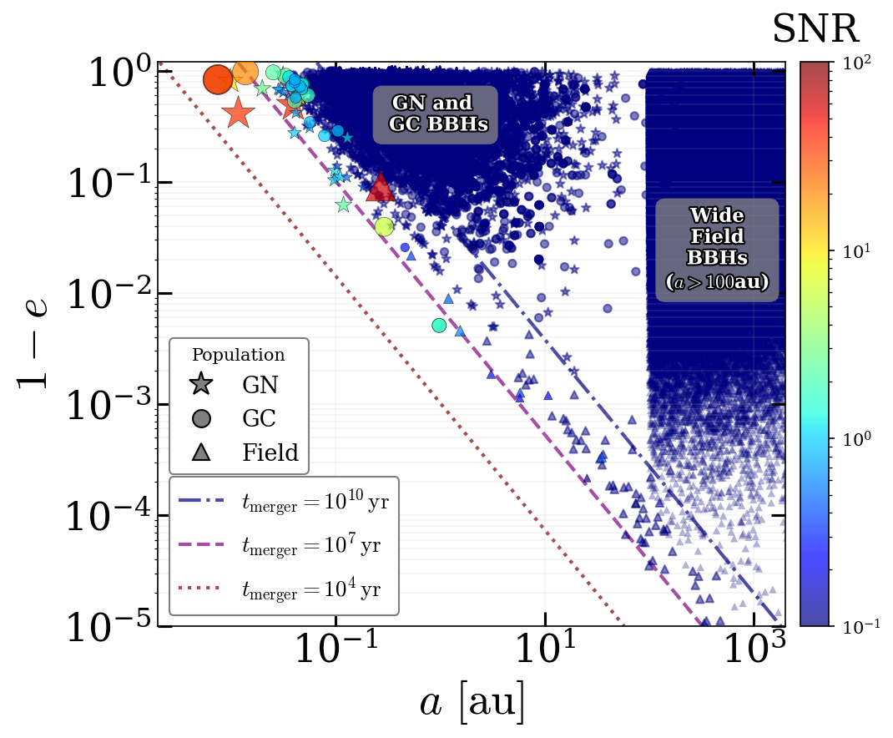
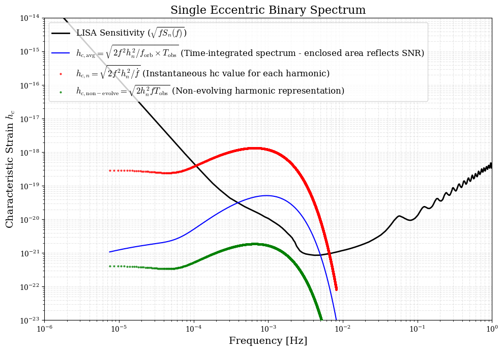

# leap: LISA Eccentricity Astrophysics Package
**Xuan et al. (2026)**

## 📖 Overview

**LEAP** (distributed on PyPI/GitHub as `lisa-leap`) is a Python toolkit for generating eccentric compact binary populations and computing their gravitational wave signals in the LISA band. It supports population synthesis, waveform computation, and signal analysis, including:

### 📂 BBH Population Catalogs
> **Note:** Each module provides methods such as **sample merger eccentricities** and **generate population snapshots**. The snapshot functions return a list of [**`CompactBinary`**](#compactbinary-class) objects.

* 🌌 [**Galactic Nuclei (GN)**](#31-galactic-nuclei-gn): SMBH-perturbed mergers (steady-state & starburst)
    * *Based on:* Hoang et al. (2018, ApJ 856, 140); Xuan et al. (2024a, ApJ 965, 148); Stephan et al. (2019, ApJ 878, 58)

* ✨ [**Globular Clusters (GC)**](#32-globular-clusters-gc): Dynamically formed BBHs, including in-cluster and ejected mergers
    * *Based on:* Kremer et al. (2020, ApJS 247, 48); Zevin et al. (2020, ApJ 903, 67); Xuan et al. (2025b, ApJL 985, L42)

* 🌠 [**Galactic Field**](#33-galactic-field-field): Fly-by–induced mergers in Milky Way–like and elliptical galaxies
    * *Based on:* Michaely & Perets (2019, ApJL 887, L36); Raveh et al. (2022, MNRAS 514, 4246); Michaely & Naoz (2022, ApJ 936, 184); Xuan et al. (2024a, ApJ 965, 148)


### 🛠 Waveform & Signal Analysis

> **Note:** Perform calculations via high-level **`CompactBinary` objects**, **OR** input parameters directly into the **Functional API**:

* Generate PN-based, time-domain waveforms for eccentric binaries (via [**Class Method**](#compute_waveform) or [**Functional API**](#leapwaveformcompute_waveform)). [Phys. Rev. D 82, 024033]
* Evolve orbital parameters throughout the inspiral stage (via [**Class Method**](#evolve_orbit) or [**Functional API**](#leapwaveformevolve_orbit)). [Peters 1964, Phys. Rev. 136, B1224]
* Compute the LISA detector response (Michelson signal) for a given GW waveform (via [**Functional API**](#leapwaveformcompute_lisa_response)). [Phys. Rev. D 67, 022001]
* Evaluate characteristic strain ($h_c$) and stochastic backgrounds (via [**Class Method**](#compute_characteristic_strain) or [**Functional API**](#leapwaveformcompute_characteristic_strain_single)). [Phys. Rev. D 110, 023020]
* Calculate signal-to-noise ratio (SNR) and noise-weighted inner products (via [**Class Method**](#compute_snr_analytical) or [**Functional API**](#leapwaveformcompute_snr_analytical)).

---

## 💾 Installation

You can install `lisa-leap` directly from GitHub. Please choose the method that matches your environment.

> **Note on naming:** The distribution package name (used by `pip`) is `lisa-leap`, while the import name (used inside Python code) is `leap`.

#### Method 1: Jupyter Notebook / Google Colab 
If you are working in a notebook (Jupyter, Colab, Kaggle), run the following command in a code cell.
```
!pip install https://github.com/zeyuanxuan/lisa-leap/archive/refs/heads/main.zip
```

#### Method 2: Terminal / Command Line
If you are using a standard terminal, run the command without the `!`
```
pip install https://github.com/zeyuanxuan/lisa-leap/archive/refs/heads/main.zip
```
**Note for Mac/Linux:** If `pip` is not found or defaults to Python 2, try `pip3` instead:
```
pip3 install https://github.com/zeyuanxuan/lisa-leap/archive/refs/heads/main.zip
```

#### Method 3: University Clusters / HPC
If you are running jobs on a cluster using existing Python modules (like `module load python/3.9.6`), **load the same module before installing.**

Step 1 — load the Python module you intend to use in your job script:
```
# Example: if your submission script uses python/3.9.6, load it now:
module load python/3.9.6
```
Step 2 — install the package with `--user`. This installs the package into your local directory specific to that Python version (e.g., `~/.local/lib/python3.9/site-packages`).
```
python3 -m pip install --user https://github.com/zeyuanxuan/lisa-leap/archive/refs/heads/main.zip
```
Step 3 — import `leap` in your code and run your job:
```
# In your job script (.sh/.pbs):
module load python/3.9.6
python your_script.py
```

#### Updating to the Latest Version
If you have previously installed `lisa-leap` and want to pull the latest updates from the `main` branch. To force a clean reinstallation, add the `--upgrade`, `--no-cache-dir`, and `--force-reinstall` flags:

```bash
pip install --upgrade --no-cache-dir --force-reinstall "https://github.com/zeyuanxuan/lisa-leap/archive/refs/heads/main.zip"
```

---
## ⚡ Quickstart

Once `lisa-leap` is installed, you can walk through the most common workflow below: build a Milky Way catalog, pick one binary from it, and then run the full signal-analysis pipeline (waveform → spectrum → characteristic strain → SNR) on that single source.

```python
import leap

# -----------------------------------------------------------------
# 1. Generate a Milky Way eccentric-GW source catalog (Running this step may take some time)
# -----------------------------------------------------------------
mw_catalog = leap.getMWcatalog(plot=True, tobs_yr=10.0)
print(f"Catalog size: {len(mw_catalog)} systems")

# Each entry is [label, m1 (msun), m2 (msun), a (au), e, Dl (kpc), snr, metadata_dict].
# Pick the highest-SNR source for a detailed look:
best = max(mw_catalog, key=lambda row: row[6])
label, m1, m2, a, e, Dl, snr, meta = best
print(f"Brightest source: {label} | M={m1:.1f}+{m2:.1f} Msun, "
      f"a={a:.3e} AU, e={e:.4f}, SNR={snr:.2f} for 10yr observation")

# -----------------------------------------------------------------
# 2. Wrap it as a CompactBinary object for analysis
# -----------------------------------------------------------------
binary = leap.CompactBinary(
    m1=m1, m2=m2, a=a, e=e, Dl=Dl,
    label=label
)

# -----------------------------------------------------------------
# 3. Time-domain waveform  (h_+, h_x)
# -----------------------------------------------------------------
t_vec, h_plus, h_cross = binary.compute_waveform(
    tobs_yr=0.5, points_per_peak=50, plot=True
)

# -----------------------------------------------------------------
# 4. Numerical spectrum  (hc_num via FFT of the waveform above)
# -----------------------------------------------------------------
f_axis, hc_num = binary.get_spectrum(
    tobs_yr=0.5, polarization='hplus', plot=True
)

# -----------------------------------------------------------------
# 5. Characteristic strain  (analytic, non-evolving limit)
# -----------------------------------------------------------------
freq, hc_env, hc_insp, hc_nonevolve, snr_contrib = \
    binary.compute_characteristic_strain(tobs_yr=4.0, plot=True)

# -----------------------------------------------------------------
# 6. Sky-averaged SNR  (full harmonic integration)
# -----------------------------------------------------------------
snr_val = binary.compute_snr_analytical(tobs_yr=4.0)
print(f"4-year sky-averaged SNR = {snr_val:.2f}")
```

For deeper control — custom populations, LISA-response projection, noise-curve swaps, batch population strain, numerical inner product, etc. — see the corresponding sections in §3–§5 below.

---
## 🚀 If you simply want to get a catalog...

> **📥 Pre-generated catalog available:** If you don't want to run the generator yourself, a pre-computed catalog of 10 Milky Way realizations is shipped with the repository as `MW_BBH_catalog_10realizations.csv` and can be downloaded directly from the GitHub page. Each row follows the same schema as the `getMWcatalog()` return value (see below), so you can load it with `pandas` or `numpy` and plug the rows into `CompactBinary.from_list(row, schema='snapshot_std')` for downstream analysis.

Or, you can use the all-in-one `getMWcatalog()` function.

This feature randomly generates snapshot populations from all three formation environments in the Milky Way (Galactic Nuclei, Globular Clusters, and the Galactic Field), estimates their analytical SNRs, and visualizes the entire population in a single scatter plot.


#### `leap.getMWcatalog()`
* **Input**:
    * `plot` (bool, optional): If `True`, generates a $1-e$ vs. $a$ scatter plot of the entire Milky Way catalog. Default is `True`.
    * `include_field_bkg` (bool, optional): If `True`, incorporates the background wide-field binaries into the catalog (which are largely irrelevant to the mHz GW source catalog but useful as a visual reference). Default is `False`.
    * `bkg_pct` (float, optional): Fraction of the background wide-field-binaries population to simulate (e.g., `0.01` for 1%). Default is `0.01`.
    * `tobs_yr` (float, optional): Observation time in years used for SNR calculation. Default is `10.0`.
* **Output**:
    * A list of generated binary systems. Each element is formatted as: `[label, m1, m2, a, e, Dl, snr, metadata_dict]`. The `metadata_dict` preserves the detailed physical origin (e.g., specific globular cluster names, or `GN_YNC`/`GN_steadystate`) under the `'source_label'` key.

**Example:**
```python
import leap

# Generate the full Milky Way catalog and plot it
mw_catalog = leap.getMWcatalog(
    plot=True,
    include_field_bkg=True,
    bkg_pct=0.01,
    tobs_yr=10.0
)

# Inspect the first system in the catalog
first_system = mw_catalog[0]
label, m1, m2, a, e, Dl, snr, metadata = first_system

print(f"\nPopulation size: {len(mw_catalog)} systems")
print(f"Sample System [{label}]: m1={m1} M_sun, m2={m2} M_sun, a={a:.4e} AU, e={e:.4f}")
print(f"Original Source: {metadata.get('source_label', 'Unknown')}")
```
* **Output** (approximate — exact counts depend on stochastic realization and the shipped Field aggregate file):
  ```
   Population size: ~7e5 systems (with background) / ~2e3 systems (without)
   Sample System [GN]: m1=7.328737 M_sun, m2=9.115064 M_sun, a=3.3044e-02 AU, e=0.8935
   Original Source: GN_YNC
  ```
<p align="left">
  
</p>

---
## 🎯 Features & Usage Examples

### 1️⃣ Global Configuration

#### `leap.set_output_control`
Sets the global verbosity and warning suppression levels.
* **Input**:
    * `verbose` (bool): If `False`, disables internal library printing.
    * `show_warnings` (bool): If `False`, suppresses warnings (e.g., `RuntimeWarning`).
* **Output**: `None`.

**Example:**
```python
# Silence both stdout prints and warnings from internal routines
leap.set_output_control(verbose=False, show_warnings=False)
```

---

<a id="compactbinary-class"></a>
### 2️⃣ CompactBinary Class
The core class of the package. Each object represents a single binary system, managing its physical properties, orbital evolution, waveform generation, and data storage.

#### `leap.CompactBinary()`
To create a binary system object:

* **Input**:
    * `m1`, `m2` (float): Masses [$M_\odot$].
    * `a` (float): Semi-major axis [au].
    * `e` (float): Eccentricity (`0 <= e < 1`).
    * `Dl` (float): Luminosity distance [kpc].
    * `label` (str): Identifier string (free-form).
    * `extra` (dict, optional): Dictionary for storing extended parameters (e.g., SNR, inclination **[rad]**, spin, lifetime). Analysis methods that derive quantities (e.g. `compute_fpeak`, `compute_merger_time`, `compute_snr_analytical`) will also write their results here.
* **Output**: `CompactBinary` object.

**Example:**
```python
my_binary = leap.CompactBinary(
    m1=10.0, m2=10.0, a=0.26, e=0.985, Dl=8.0,
    label="Tutorial_Core_Obj",
    extra={
        'inclination': 0.7854,  # [rad] (~45 degrees)
    }
)
print(f"   Output Object: {my_binary}")
print(f"   Type Inspection: {type(my_binary)}")
# You can also access extra data directly
print(f"   Inclination: {my_binary.extra['inclination']:.4f} rad")
```
* **Output**:
  ```
   Output Object: <CompactBinary [Tutorial_Core_Obj]: M=10.0+10.0 m_sun, a=2.600e-01AU, e=0.9850, Dl=8.0kpc | inclination=0.785>
   Type Inspection: <class 'leap.core.CompactBinary'>
   Inclination: 0.7854 rad
  ```

---

#### `.to_list()` `.from_list()`
Methods to convert `CompactBinary` objects to and from list formats, facilitating data storage (e.g., to CSV/NumPy files) and retrieval.
* **.to_list()**:
    * **Input**: `schema` (str) — formatting standard (default: `'snapshot_std'`, i.e., `[label, Dl, a, e, m1, m2, snr]`). The `snr` value is read from `self.extra['snr']` (defaults to `0.0` if absent).
    * **Output**: A list representing the system's data.
* **.from_list()** (classmethod):
    * **Input**: `data_list` (list) — raw values; `schema` (str) — one of `'snapshot_std'`, `'gn_prog'`, `'field_prog'`. For `'field_prog'`, masses must be supplied via `aux_params={'m1': ..., 'm2': ...}` since the row itself does not carry them.
    * **Output**: A new `CompactBinary` object instantiated from the list.

**Example:**
```python
# Export
print("   A. to_list(schema='snapshot_std')")
data_row = my_binary.to_list(schema='snapshot_std')
print(f"      Output: {data_row} (Type: List)")

# Import
print("   B. from_list(data_list=..., schema='snapshot_std')")
raw_in = ["Imp_Sys", 16.8, 0.5, 0.9, 50.0, 50.0, 0.0]
new_obj = leap.CompactBinary.from_list(data_list=raw_in, schema='snapshot_std')
print(f"      Output: {new_obj}")
```
* **Output**:
    ```
    A. to_list(schema='snapshot_std')
      Output: ['Tutorial_Core_Obj', 8.0, 0.26, 0.985, 10.0, 10.0, 0.0] (Type: List)
    B. from_list(data_list=..., schema='snapshot_std')
      Output: <CompactBinary [Imp_Sys]: M=50.0+50.0 m_sun, a=0.50AU, e=0.9000, Dl=16.8kpc, snr=0.000>
    ```

---

#### `.compute_merger_time()`
Calculates the remaining time until the merger due to gravitational wave emission (Peters 1964 formula).
* **Input**:
    * `verbose` (bool, optional): Controls standard output printing. Default is `True`.
* **Output**:
    * `t_merge_yr` (float): Time to merger in years.
    * **Note**: The result is also stored in `self.extra['merger_time_yr']`.

**Example:**
```python
t_merge_yr = my_binary.compute_merger_time(verbose=False)
print(f"      Return Value: {t_merge_yr:.4e} [years] (Type: float)")
```
* **Output**:
  ```
         Return Value: 4.8407e+06 [years] (Type: float)
  ```

---

#### `.compute_snr_analytical()`
Computes the sky-averaged Signal-to-Noise Ratio (SNR) for the LISA detector. This method supports two calculation modes: full integration over harmonics (default) or a fast geometric approximation.
* **Input**:
    * `tobs_yr` (float): Observation duration in years.
    * `quick_analytical` (bool, optional):
        * If `False` (default): Uses full integration (summing over harmonics via `PN_waveform.SNR`).
        * If `True`: Uses a fast geometric approximation based on peak frequency and amplitude, suitable for high-$e$ systems.
    * `verbose` (bool, optional): Controls standard output printing. Default is `True`.
* **Output**:
    * `snr_val` (float): The calculated SNR value.
    * **Note**: The result is also stored in `self.extra['snr_analytical']`.
* **Notes:**
    * The calculation assumes the binary's evolution is negligible during the observation.
    * If the system's merger time is shorter than `tobs_yr`, the effective observation time is automatically capped at `t_merger` (with `quick_analytical=True` this also triggers a printed warning).

**Example:**
```python
snr_val = my_binary.compute_snr_analytical(tobs_yr=4.0, verbose=False, quick_analytical=False)
print(f"      Return Value: {snr_val:.4f} (Type: float)")
```
* **Output**:
  ```
      Return Value: 10.9644 (Type: float)
  ```

---

#### `.compute_fpeak()`
Calculates the peak gravitational wave frequency ($f_{\rm peak}$) for the eccentric binary using the Wen (2003) approximation:
$$f_{\rm peak} \approx f_{\rm orb} \cdot \frac{(1+e)^{1.1954}}{(1-e)^{1.5}} \, .$$

> Note: This follows the convention of Wen 2003 eq. 36 — it is the frequency of the peak-power harmonic expressed in terms of $f_{\rm orb}$, not the circular-orbit GW frequency $2f_{\rm orb}$.

* **Input**:
    * `verbose` (bool, optional): Controls standard output printing. Default is `True`.
* **Output**:
    * `f_peak` (float): Peak GW frequency [Hz].
    * **Note**: The result is also stored in `self.extra['f_peak_Hz']`.

**Example:**
```python
f_peak = my_binary.compute_fpeak(verbose=False)
print(f"      Return Value: {f_peak:.4e} [Hz] (Type: float)")
```
* **Output**:
  ```
       Return Value: 1.3205e-03 [Hz] (Type: float)
  ```

---

#### `.evolve_orbit()`
Predicts the future state of the binary system by evolving its orbital parameters forward in time due to gravitational wave emission (Peters 1964 formula). Supports negative `delta_t_yr` for inverse evolution.
* **Input**:
    * `delta_t_yr` (float): Time duration to evolve the system, in years.
    * `update_self` (bool, optional):
        * If `True`: Updates the `a` and `e` attributes of the `CompactBinary` object itself.
        * If `False` (default): Returns the new values without modifying the object.
    * `verbose` (bool, optional): Controls standard output printing.
* **Output**:
    * `(a_new, e_new)` tuple:
        * `a_new` (float): Evolved semi-major axis [au].
        * `e_new` (float): Evolved eccentricity.

**Example:**
```python
a_new, e_new = my_binary.evolve_orbit(delta_t_yr=1000.0, update_self=False, verbose=False)
print(f"      Return Tuple: a={a_new} au, e={e_new}")
```
* **Output**:
  ```
        Return Tuple: a=0.25991616861323 au, e=0.9849951873952284
  ```

---

#### `.compute_waveform()`
A convenience method to compute the Gravitational Wave (GW) waveform specifically for the initialized binary system. It automatically uses the object's internal physical attributes ($m_1, m_2, a, e, D_L$) and supports adaptive time sampling.
* **Input**:
    * Observation:
        * `tobs_yr` (float): Observation duration in years.
        * `initial_orbital_phase` (float, optional): Initial mean anomaly $l_0$ [rad]. Default `0`.
    * Source Geometry:
        * `theta` (float, optional): Line-of-sight polar angle in source frame [rad]. Default $\pi/4$.
        * `phi` (float, optional): Line-of-sight azimuthal angle in source frame [rad]. Default $\pi/4$.
    * Physics Model:
        * `PN_orbit` (int, optional): PN order for conservative orbital dynamics (0, 1, 2, 3). Default `3`.
        * `PN_reaction` (int, optional): PN order for radiation reaction (0, 1, 2). Default `2`.
    * Computational Control:
        * `ts` (float, optional): Fixed sampling time step [s]. If `None` (default), uses adaptive sampling.
        * `points_per_peak` (int, optional): Resolution for adaptive sampling (points per periastron passage). Default `50`.
        * `max_memory_GB` (float, optional): Safety limit for array size in GB. Default `16.0`.
    * Output Control:
        * `plot` (bool, optional): If `True`, plots $h_+$.
        * `verbose` (bool, optional): Controls standard output printing.
* **Output**:
    * A list of three NumPy arrays: `[time_vector, h_plus, h_cross]`. Returns `None` if calculation fails.
* **Notes:**
    * If the merger time is shorter than `tobs_yr`, the waveform is truncated at ISCO.
    * `e = 0` is not supported by the eccentric PN template (singularities in PN terms). It is automatically reset to `1e-5` with a printed warning.

**Example:**
```python
wf_data_obj = my_binary.compute_waveform(
    tobs_yr=1.0, points_per_peak=50, verbose=False, plot=True
)
```
* **Output**:
<p align="left">
  
</p>

---

#### `.get_spectrum()`

Automatically generates the time-domain waveform for the binary system and computes its **numerical spectrum representation** ($h_{c, \mathrm{num}}$) via Fast Fourier Transform (FFT).

* **Physics Note (Ref: Appendix A.3 of Xuan et al. 2026)**: In the non-evolving limit ($\dot{f} \to 0$), the comb-like peak heights of the numerical spectrum ($h_{c, \mathrm{num}}$) coincide with the discrete harmonic representation ($h_{c, \mathrm{non\text{-}evolve}}$). Because the smoothed spectrum ($h_{c, \mathrm{env}}$) redistributes energy to preserve the integrated SNR, these numerical peaks will appear lower than the smoothed envelope by a factor of $\sqrt{f_{\mathrm{orb}}/f}$.

* **Input**:
    * **Observation & Signal**:
        * `tobs_yr` (float): Observation duration in years.
        * `polarization` (str, optional): Waveform polarization to analyze (`'hplus'` or `'hcross'`). Default `'hplus'`.
        * `theta`, `phi` (float, optional): Sky position angles [rad]. Default $\pi/4$.
        * `initial_orbital_phase` (float, optional): Initial mean anomaly [rad]. Default `0`.
    * **Sampling & Control**:
        * `ts` (float, optional): Fixed sampling time step [s]. If `None` (default), adaptive sampling is used and the equivalent rate is recovered automatically for the FFT.
        * `points_per_peak` (int, optional): Resolution for adaptive sampling. Default `50`.
        * `PN_orbit`, `PN_reaction` (int, optional): PN orders. Default `3`, `2`.
        * `plot` (bool, optional): If `True`, plots the numerical characteristic strain against the LISA noise curve.
        * `verbose` (bool, optional): Controls standard output printing.

* **Output**:
    * A `tuple` of two NumPy arrays: `(freq_axis, hc_num)`.
        * `[0] freq_axis`: Frequency axis [Hz] (positive half-space).
        * `[1] hc_num`: Numerical characteristic strain spectrum ($h_{c, \mathrm{num}}$).

**Example:**
```python
# Extract the spectrum directly from a CompactBinary object
f_axis, hc_num = my_binary.get_spectrum(
    tobs_yr=1.0,
    ts=5.0,                 # 5-second sampling interval
    polarization='hplus',   # analyze the plus polarization
    plot=True
)

print(f"   Output: Tuple of 2 Elements")
print(f"      [0] Frequency Axis     (shape: {f_axis.shape})")
print(f"      [1] Numerical Spectrum (shape: {hc_num.shape})")
print(f"   Peak Numerical Strain: {np.max(hc_num):.4e}")
```
* **Output**:
   ```
      Output: Tuple of 2 Elements
        [0] Frequency Axis     (shape: (1767549,))
        [1] Numerical Spectrum (shape: (1767549,))
   ```
<p align="left">

</p>

---

#### `.compute_characteristic_strain()`

Computes the characteristic strain spectrum ($h_c$) for the binary system. This method provides different physically equivalent representations of the characteristic strain; see Appendix A.2 and A.3 of Xuan et al. (2026) for details.

> **Note:** This fast calculation method assumes the binary's evolution is negligible during the observation. For systems with significant chirp during `tobs_yr`, use `.compute_characteristic_strain_evolve()` instead.

* **Input**:
    * `tobs_yr` (float): Integration time in years.
    * `plot` (bool, optional): If `True`, generates a spectrum plot.

* **Output**:
    * A list of 5 NumPy arrays: `[freq, hc_spectrum, hc_harmonics, hc_non_evolve, snr_contrib]`.

        * `[0] freq`: Frequency list [Hz].

        * `[1] hc_spectrum`: Smoothed spectrum representation ($h_{c,\mathrm{env}}(f)$).
          Formula: $h_{c,\mathrm{env}} = \sqrt{2}\, h_n \sqrt{f T_{\mathrm{obs}}} \sqrt{f / f_{\mathrm{orb}}}$.
          This continuous envelope redistributes the power of discrete harmonics over frequency space so that the area between it and the noise curve in a log–log plot directly reflects the integrated SNR.

        * `[2] hc_harmonics`: Individual harmonic representation ($h_{c,\mathrm{insp}}$).
          Formula: $h_{c,\mathrm{insp}} = \sqrt{2}\, h_n \sqrt{f^2 / \dot{f}}$.
          Pre-integration (evolving) characteristic strain amplitude of individual harmonics.

        * `[3] hc_non_evolve`: Non-evolving / discrete harmonic representation ($h_{c,\mathrm{non\text{-}evolve}}$).
          Formula: $h_{c,\mathrm{non\text{-}evolve}} = \sqrt{2}\, h_n \sqrt{f T_{\mathrm{obs}}}$.
          Post-integration peak height of each discrete harmonic assuming $\dot{f} \to 0$.

          In practice, they are combined as:
          $h_c = \sqrt{2}\, h_n \sqrt{ \min( f^2 / \dot{f},\; f T_{\mathrm{obs}} ) }$.

        * `[4] snr_contrib`: Contribution to the noise power spectral density $S_n(f)$ at harmonic frequencies.

**Example:**
```python
strain_res_list = my_binary.compute_characteristic_strain(tobs_yr=4.0, plot=True)
```
* **Output**:
<p align="left">
  
</p>

---

#### `.compute_characteristic_strain_evolve()`
Computes the **time-evolving** characteristic strain spectrum ($h_c$) by integrating the signal along the binary's evolutionary track (Peters 1964 equations). This method captures the "chirping" of harmonics across the frequency band.
> **Note:** Unlike `.compute_characteristic_strain()`, this handles significant orbital evolution (chirping) during the observation window.

* **Input**:
    * `tobs_yr` (float): Integration time in years.
    * `target_n_points` (int, optional): Number of harmonics to track for visualization. Default `100`. Ignored if `all_harmonics=True`.
    * `all_harmonics` (bool, optional):
        * `False` (default): Uses optimized high-density sampling for spectrum integration and sparse sampling for plotting tracks. Fast and visually clear.
        * `True`: Forces calculation of *all* integer harmonics within the band. Slower but rigorous.
    * `plot` (bool, optional): If `True`, generates a plot showing both the instantaneous harmonic tracks and the total integrated spectrum.
    * `verbose` (bool, optional): Controls standard output printing.

* **Output**:
    * A list of 4 elements: `[freq, hc_spectrum, snapshots, snr]`.
        * `[0] freq`: Unified frequency axis [Hz] (log-spaced).
        * `[1] hc_spectrum`: Total time-integrated characteristic strain ($h_{c,\rm avg}$) accumulated over $T_{\rm obs}$.
        * `[2] snapshots`: A list of dictionaries, where each dictionary represents the system's state at a specific time step (containing `t`, `f_orb`, `n`, `freq`, `hnc`).
        * `[3] snr`: The integrated SNR calculated from the spectrum.

**Example:**
```python
my_binary_evolve = leap.CompactBinary(
    m1=1e5, m2=30.0,
    a=0.26, e=0.9, Dl=765.0,
    label="Evolving_Source_Example"
)
evolve_res = my_binary_evolve.compute_characteristic_strain_evolve(
    tobs_yr=0.5,
    target_n_points=50,
    all_harmonics=False,
    plot=True,
    verbose=True
)
if evolve_res is not None:
    f_axis, hc_total, snapshots, snr = evolve_res
    print(f"\n   Output Inspection (List of 4 Elements):")
    print(f"      [0] Unified Frequency Axis (shape: {f_axis.shape})")
    print(f"          - Range: {f_axis[0]:.1e} Hz to {f_axis[-1]:.1e} Hz")
    print(f"      [1] Total Integrated Strain (h_c) (shape: {hc_total.shape})")
    print(f"          - Peak Amplitude: {np.max(hc_total):.4e}")
    print(f"      [2] Snapshots List (Length: {len(snapshots)})")
    print(f"          - Contains time-step details (t, f_orb, e, n, hnc...)")
    print(f"          - Example Keys: {list(snapshots[0].keys()) if len(snapshots)>0 else 'Empty'}")
    print(f"      [3] Integrated SNR (float)")
    print(f"          - Value: {snr:.4f}")
```
* **Output**:
  ```
   Output Inspection (List of 4 Elements):
      [0] Unified Frequency Axis (shape: (2000,))
          - Range: 1.0e-06 Hz to 1.0e+00 Hz
      [1] Total Integrated Strain (h_c) (shape: (2000,))
          - Peak Amplitude: 7.4468e-18
      [2] Snapshots List (Length: 100)
          - Contains time-step details (t, f_orb, e, n, hnc...)
          - Example Keys: ['t', 'f_orb', 'n', 'freq', 'hnc']
      [3] Integrated SNR (float)
          - Value: 8069.5495
  ```
<p align="left">
  
</p>

---

### 3️⃣ Population analysis

### 3.1 Galactic Nuclei (GN)
This module models Binary Black Holes formed dynamically in Milky Way–like galactic nuclei (due to the perturbation of a central supermassive black hole). It is based on detailed three-body simulations.

---

#### `leap.GN.sample_eccentricities()`
Randomly samples $N$ merger eccentricities for BBHs formed in Galactic Nuclei, defined at the LIGO frequency band (10 Hz).
* **Input**:
    * `n_samples` (int): Number of eccentricity samples to generate.
    * `max_bh_mass` (float, optional): Maximum BH mass to consider for the population filter [$M_\odot$]. Default `50`.
    * `plot` (bool, optional): If `True`, plots the CDF of $\log_{10}(e)$.
* **Output**:
    * `gn_e_samples` (NumPy array): 1D array of sampled eccentricity values at 10 Hz.

**Example:**
```python
gn_e_samples = leap.GN.sample_eccentricities(
    n_samples=5000, max_bh_mass=50.0, plot=True
)
print(f"   Output Shape: {np.shape(gn_e_samples)}")
print(f"   Mean Eccentricity: {np.mean(gn_e_samples)}")
```
* **Output**:
    ```
    Output Shape: (5000,)
    Mean Eccentricity: 3.791297808628803e-05
    ```
<p align="left">

</p>

---

#### `leap.GN.get_progenitor()`
Retrieves the properties of the binary progenitors (initial states) from the underlying population catalog (BBHs in GN, orbiting a SMBH with $M = 4 \times 10^6\,M_\odot$). These are the systems **before** they evolve to merger.
* **Input**:
    * `n_inspect` (int, optional): Number of random systems to retrieve for inspection. Default `3`.
* **Output**:
    * A list of `CompactBinary` objects representing the progenitor systems.
    * **Note**: The objects contain detailed GN evolutionary parameters in their `extra` attributes (e.g., outer-orbit SMA `a2_init`, eccentricity `e2_init`, initial mutual orbit inclination `i_init_rad`, final `a_final`/`e_final`, and total `lifetime_yr`).

**Example:**
```python
gn_progenitors = leap.GN.get_progenitor(n_inspect=3)
print(f"   Output List Length: {len(gn_progenitors)}")
print(f"   Sample Item: {gn_progenitors[0]}")
```
* **Output**:
    ```
   Output List Length: 3
   Sample Item: <CompactBinary [GN_Progenitor]: M=50.6+25.7 m_sun, a=3.395e-01AU, e=0.9278, Dl=8.0kpc | e2_init=0.505, i_init_rad=2.167, a2_init=1.57e+04, a_final=1.45e-05, e_final=3.04e-06, lifetime_yr=1.03e+08>
    ```

---

#### `leap.GN.get_snapshot()`
Generates a snapshot of the BBH population currently in the GN. This includes systems from both the steady-state formation channel and a recent starburst event (Young Nuclear Cluster, YNC). The results can be changed by adjusting the BBH formation rate in the steady-state population and the age / total BBH number in the YNC population.
* **Input**:
    * `rate_gn` (float, optional): Merger rate for the steady-state channel [Myr$^{-1}$]. Default `2.0`.
    * `age_ync` (float, optional): Age of the Young Nuclear Cluster [yr]. Default `6.0e6`.
    * `n_ync_sys` (int, optional): Number of systems to simulate for the YNC channel. Default `100`.
    * `max_bh_mass` (float, optional): Maximum BH mass to consider [$M_\odot$]. Default `50`.
    * `plot` (bool, optional): If `True`, plots the snapshot population ($1-e$ vs. $a$, color-coded by SNR).
* **Output**:
    * A list of `CompactBinary` objects representing the BBHs currently in the Milky Way center, sorted by SNR (high to low). Each object stores the current inclination in `extra['inclination_rad']` and the instantaneous SNR in `extra['snr']`.

**Example:**
```python
gn_snapshot = leap.GN.get_snapshot(
    rate_gn=2.0, age_ync=6.0e6, n_ync_sys=100, max_bh_mass=50.0, plot=True
)
print(f"   Output List Length: {len(gn_snapshot)} systems")
```
* **Output**:
    ```
   Output List Length: 1806 systems
    ```
<p align="left">

</p>

---

### 3.2 Globular Clusters (GC)
This module models Binary Black Holes formed dynamically in Milky Way globular clusters. It supports sampling from specific dynamical formation channels (e.g., Kozai–Lidov triples, binary–single captures) based on detailed Monte Carlo N-body simulations.

---

#### `leap.GC.sample_eccentricities()`
Randomly samples $N$ merger eccentricities for GC BBHs at the LIGO frequency band (10 Hz).
* **Input**:
    * `n` (int): Number of eccentricity samples to generate.
    * `channel_name` (str, optional): Specific formation channel. Default `'Incluster'`.
        * `'Incluster'`: Weighted average of all in-cluster channels.
        * `'Ejected'`: Mergers occurring after ejection.
        * **Sub-channels**: Supports specific dynamical channels such as `'KL Triple'`, `'Non-KL Triple'`, `'Single Capture'`, `'Fewbody Capture'`.
    * `plot` (bool, optional): If `True`, plots the CDF of $\log_{10}(e)$.
* **Output**:
    * `gc_e_samples` (NumPy array): 1D array of sampled eccentricity values at 10 Hz.

**Example:**
```python
gc_e_samples = leap.GC.sample_eccentricities(
    n=5000, channel_name='KL Triple', plot=True
)
print(f"   Output Shape: {np.shape(gc_e_samples)}")
```
* **Output**:
    ```
   Output Shape: (5000,)
    ```
<p align="left">

</p>

---

#### `leap.GC.get_snapshot()`
Retrieves a snapshot of the GC BBH population in the Milky Way. Supports three retrieval modes to allow for different scales of analysis (full ensemble vs. single galaxy realization).
* **Input**:
    * `mode` (str, optional): Data selection mode. Default `'10_realizations'`.
        * `'10_realizations'`: Returns the full catalog from 10 MW realizations (~2300 systems).
        * `'single'`: Returns data from a single MW realization (randomly selected 1/10 subset of the full catalog, ~230 systems).
        * `'random'`: Returns a specified number of randomly selected systems.
    * `n_random` (int, optional): Number of systems to retrieve (only used if `mode='random'`). Default `500`.
    * `channel` (str, optional): Target population group. Default `'all'`.
      * `'all'`: Both in-cluster and ejected populations.
      * `'incluster'`: In-cluster only (`Mock_GC_BBHs.csv`).
      * `'ejected'`: Ejected only (`Mock_GC_BBHs_ejected.csv`).
    * `plot` (bool, optional): If `True`, plots the snapshot ($1-e$ vs $a$).
* **Output**:
    * A list of `CompactBinary` objects.
    * **Warning**: The underlying catalog represents a finite set of simulations (~230 systems per realization). If `n_random` exceeds the size of a single realization, the returned sample will inevitably mix systems from different stochastic realizations. Due to the small sample size of the MC N-body source catalog, these samples may not be strictly statistically independent.

**Example:**
```python
gc_data_full = leap.GC.get_snapshot(mode='10_realizations', plot=True)
print(f"   Output List Length: {len(gc_data_full)}")
```
* **Output**:
    ```
   Output List Length: 2325
    ```
<p align="left">

</p>

---

### 3.3 Galactic Field (Field)
This module models Binary Black Hole mergers formed via dynamical fly-by interactions in galactic field environments. It supports simulations for both Milky Way-like (disk) galaxies and elliptical galaxies.

---

#### `leap.Field.run_simulation()`
Executes a Monte Carlo simulation to generate a population of fly-by mergers based on specific galactic structure and physical parameters. The results are saved to disk (inside the package's `data/` directory) for subsequent analysis (sampling / snapshotting).

* **Input**:
    * `galaxy_type` (str, optional): Target environment. `'MW'` (Milky Way) or `'Elliptical'`. Default `'MW'`.
    * **Physics parameters**:
        * `m1`, `m2`, `mp` (float, optional): Masses of the binary components and perturber [$M_\odot$]. Default `10`, `10`, `0.6`.
        * `fbh` (float, optional): Fraction of stars that are wide binary black holes. Default `7.5e-4`.
        * `fgw` (float, optional): Gravitational wave frequency used as the reference for the eccentricity distribution (default 10 Hz = LIGO band).
        * `formation_mod` (str, optional): Star formation history model (`'starburst'`, `'continuous'`). Default `'starburst'`.
    * **Structure parameters (MW)**:
        * `n0` (float, optional): Stellar number density normalization in the solar neighborhood [pc$^{-3}$]. Default `0.1`.
        * `rsun` (float, optional): Distance from the solar system to the Galactic center [pc]. Default `8000.0`.
        * `Rl`, `h` (float, optional): Galactic scale lengths (radial, vertical) [pc]. Default `2600.0`, `1000.0`.
        * `sigmav` (float, optional): Velocity dispersion [m/s]. Default `50000.0`.
        * `age_mw` (float, optional): Age of the MW galaxy [years]. Default `10e9`.
    * **Structure parameters (Elliptical)**:
        * `M_gal` (float, optional): Total mass of the galaxy [$M_\odot$]. Default `1.0e12`.
        * `Re` (float, optional): Effective radius (half-light radius) [pc]. Default `8000.0`.
        * `distance_Mpc` (float, optional): Distance to the galaxy [Mpc]. Default `16.8`.
        * `age_ell` (float, optional): Age of the elliptical galaxy [years]. Default `13e9`.
    * **Control**:
        * `arange_log` (list, optional): Range of BBH semi-major axis $\log_{10}(a/\mathrm{au})$ to sample `[min, max]`. Default `[2, 4.5]`.
        * **MW-specific**:
            * `n_sim_samples` (int, optional): Total number of MC trials. Default `200000`.
            * `target_N` (int, optional): Target number of successful mergers to accumulate. Default `100000`.
            * `rrange_mw` (list, optional): Radial range for simulation `[min, max]` [kpc]. Default `[0.5, 15]`.
            * `blocknum_mw` (int, optional): Number of radial bins used to discretize the simulation volume. Default `29`. Larger values improve resolution at higher runtime.
        * **Elliptical-specific**:
            * `ell_n_sim` (int, optional): Total number of MC trials. Default `100000`.
            * `ell_target_N` (int, optional): Target number of successful mergers. Default `50000`.
            * `rrange_ell` (list, optional): Radial range for simulation `[min, max]` [kpc]. Default `[0.05, 100]`.
            * `blocknum_ell` (int, optional): Number of radial bins. Default `60`.
* **Output**:
    * `None`. Results are saved internally to the package's `data/` directory and subsequently loaded by `get_progenitor`, `sample_eccentricities`, and `get_snapshot`.

**Example:**
```python
leap.Field.run_simulation(
    galaxy_type='MW',
    # Physics (optional overrides)
    m1=10.0, m2=10.0, mp=0.6,
    fbh=7.5e-4, fgw=10.0,
    formation_mod='starburst',
    # Structure (optional overrides)
    n0=0.1, rsun=8000.0, Rl=2600.0, h=1000.0, sigmav=50000.0,
    # Control (optional overrides)
    n_sim_samples=200000, target_N=100000, rrange_mw=[0.5, 15]
)
print("   Status: Simulation completed and saved.")
```
#### Extension: Simulating an elliptical galaxy
The simulation engine can also model massive elliptical galaxies (e.g., M87-like) by switching `galaxy_type` to `'Elliptical'` and adjusting the structural parameters ($M_{\rm gal}$, $R_e$).

**Example:**
```python
leap.Field.run_simulation(
    galaxy_type='Elliptical',
    # Structure (massive galaxy at 16.8 Mpc)
    distance_Mpc=16.8, M_gal=1.0e12, Re=8000.0,
    # Physics (heavier BHs)
    m1=30.0, m2=30.0, mp=0.6,
    # Control (smaller run for demo)
    ell_n_sim=50000, ell_target_N=20000
)
print("   Status: Elliptical simulation saved.")
```

---

#### `leap.Field.get_progenitor()`
Retrieves the properties of the binary progenitors (initial states at formation) from the simulated library. These represent the system parameters right after being perturbed to high eccentricity and starting to evolve via GW emission.

* **Input**:
    * `galaxy_type` (str, optional): Target environment. `'MW'` or `'Elliptical'`. Default `'MW'`.
    * `plot` (bool, optional): If `True`, plots the initial semi-major axis distribution and the merger-lifetime CDF. Default `True`.
* **Output**:
    * A list of `CompactBinary` objects representing the progenitor systems. The length of the list equals `target_N` (MW) or `ell_target_N` (Elliptical) of the preceding `run_simulation` call.
    * **Note**: These objects contain simulation statistics in their `extra` attributes:
        * `merger_rate`: Effective merger-rate weight for this system.
        * `lifetime_yr`: Time from formation to merger.
        * `e_final_LIGO`: Eccentricity when entering the LIGO band.
        * `tau_relax`: Relaxation / evaporation timescale.

**Example:**
```python
field_progs = leap.Field.get_progenitor(galaxy_type='MW', plot=True)
print(f"   Output List Length: {len(field_progs)}")
```
* **Output**:
    ```
   Output List Length: 50000
    ```
<p align="left">

</p>
<p align="left">

</p>

---

#### `leap.Field.sample_eccentricities()`
Randomly samples $N$ merger eccentricities for Field BBHs at the LIGO frequency band (10 Hz).
* **Input**:
    * `n` (int): Number of eccentricity samples to generate.
    * `galaxy_type` (str, optional): Target environment. `'MW'` or `'Elliptical'`. Default `'MW'`.
    * `plot` (bool, optional): If `True`, plots the CDF of $\log_{10}(e)$.
* **Output**:
    * `field_e_samples` (NumPy array): 1D array of sampled eccentricity values at 10 Hz.

**Example:**
```python
field_e_samples = leap.Field.sample_eccentricities(
    n=5000, galaxy_type='MW', plot=True
)
print(f"   Output Shape: {np.shape(field_e_samples)}")
```
* **Output**:
    ```
   Output Shape: (5000,)
    ```
<p align="left">

</p>

---

#### `leap.Field.get_snapshot()`
Generates a "snapshot" containing BBH systems currently existing in the Galactic Field. These systems represent binaries that have been excited to high eccentricity via fly-by interactions and are predicted to merge within the specified future time window (`t_window_Gyr`).
* **Input**:
    * `mode` (str, optional): Sampling mode. Default `'single'`.
        * `'single'`: One random realization based on the calculated merger rate.
        * `'multi'` (MW only): Stacks multiple realizations to reduce statistical variance.
        * `'forced'`: Randomly selects `n_systems` regardless of physical rates (useful for testing).
    * `galaxy_type` (str, optional): Target environment. Default `'MW'`.
    * `t_obs` (float, optional): Observation duration in years (SNR accumulation window). Default `10.0`.
    * `t_window_Gyr` (float, optional): Future time window in which to look for merging systems.
        * **Note**: This should ideally **not** exceed the galaxy age (e.g., 10 Gyr). Extending the window beyond the age implies looking for systems that would likely have been removed or merged earlier in the simulation history.
    * `n_realizations` (int, optional): Number of realizations (only for `mode='multi'`). Default `10`.
    * `n_systems` (int, optional): Number of systems to force-sample (only for `mode='forced'`). Default `500`.
    * `plot` (bool, optional): If `True`, plots the snapshot distribution. Default `True`.
* **Output**:
    * A list of `CompactBinary` objects representing the detectable sources.

**Example:**
```python
field_snapshot_mw = leap.Field.get_snapshot(
    mode='single', t_obs=10.0, t_window_Gyr=10.0, galaxy_type='MW', plot=True
)
print(f"   Output List Length: {len(field_snapshot_mw)}")
```
* **Output**:
    ```
   Output List Length: 72
    ```
<p align="left">

</p>

---

### 4️⃣ Waveform & Analysis Pipeline
This module provides a low-level functional interface to generate and analyze eccentric gravitational waveforms. It mirrors many of the `CompactBinary` methods but takes raw parameter inputs.

---

#### `leap.Waveform.compute_waveform()`
Generates the time-domain waveform ($h_+, h_\times$) using a PN evolution model.

* **Input**:
    * **Input mode selector**:
        * `input_mode` (str, optional): Determines how `a_au` is interpreted. Default `'a_au'`.
            * `'a_au'`: Input `a_au` is treated as **semi-major axis [au]**.
            * `'forb_Hz'`: Input `a_au` is treated as **orbital frequency [Hz]**.
            * `'fangular_Hz'`: Input `a_au` is treated as **angular/peak frequency [Hz]** (the solver finds the corresponding $f_{\rm orb}$).
        * `a_au` (float): Value corresponding to `input_mode` (name kept for API stability even though the meaning switches).
    * **Physical parameters**:
        * `m1_msun`, `m2_msun` (float): Component masses [$M_\odot$].
        * `e` (float): Orbital eccentricity.
        * `Dl_kpc` (float): Luminosity distance [kpc].
        * `tobs_yr` (float): Observation duration [years].
        * `theta`, `phi` (float, optional): Sky-position angles [rad]. Default $\pi/4$.
        * `initial_orbital_phase` (float, optional): Initial mean anomaly [rad]. Default `0`.
    * **Model & sampling**:
        * `PN_orbit`, `PN_reaction` (int, optional): Post-Newtonian orders. Default `3`, `2`.
        * `points_per_peak` (int, optional): Adaptive sampling density per periastron. Default `50`.
        * `ts` (float, optional): Fixed time step [seconds]. If set, overrides adaptive sampling.
        * `max_memory_GB` (float, optional): Array-size safety limit. Default `16.0`.
    * `plot` (bool, optional): If `True`, plots the waveform.
* **Output**:
    * A list of three NumPy arrays: `[time_vector, h_plus, h_cross]`.

**Example:**
```python
# Shift specific initial phase to show periastron GW burst
e_val = 0.99
init_phase = -5*np.pi * np.power(1 - e_val, 1.5)

waveform_data = leap.Waveform.compute_waveform(
    # --- System params ---
    m1_msun=10.0, m2_msun=10.0,
    a_au=0.1, e=e_val,          # input_mode='a_au' (default): a = 0.1 AU
    Dl_kpc=8.0,
    input_mode='a_au',
    tobs_yr=0.5,
    initial_orbital_phase=init_phase,
    theta=np.pi/4, phi=np.pi/4,
    PN_orbit=3, PN_reaction=2,
    points_per_peak=50,         # adaptive sampling resolution
    plot=True, verbose=True
)

waveform_data_B = leap.Waveform.compute_waveform(
    m1_msun=10.0, m2_msun=10.0,
    a_au=1e-5, e=0.7,           # input_mode='forb_Hz': value is f_orb = 1e-5 Hz
    Dl_kpc=8.0, tobs_yr=0.1,
    input_mode='forb_Hz', ts=10, # ts disables adaptive sampling; fix dt = 10 s
    plot=False
)
```
* **Output**:
<p align="left">

</p>

#### Data inspection & visualization
After generation, it's useful to verify the data structure, calculate the sampling interval ($\Delta t$), and visualize the waveform details (e.g., the bursty structure at periastron).

* **Key step**: calculate `dt` from the first two time points (`t[1] - t[0]`) when using fixed `ts`, or confirm the adaptive cadence.
* **Visualization**: Plotting a subset (e.g., first 500 points) allows for a quick check of the polarization phases.

**Example:**
```python
t_vec, h_plus, h_cross = waveform_data[0], waveform_data[1], waveform_data[2]

print(f"   Output Structure: List of 3 Numpy Arrays")
print(f"      t_vec shape : {t_vec.shape}")
print(f"      h_plus shape: {h_plus.shape}")
print(f"      h_cross shape: {h_cross.shape}")

# CRITICAL: Calculate Sampling Interval (dt) for next steps
dt_val_sec = t_vec[1] - t_vec[0]
print(f"   Sample time dt    : {dt_val_sec:.4e} seconds (Passed to next step)")

# Plot first 500 points to see the burst structure
plt.figure(figsize=(10, 4))
N_plot = 500
plt.plot(t_vec[:N_plot], h_plus[:N_plot], label=r'$h_+$', alpha=0.8)
plt.plot(t_vec[:N_plot], h_cross[:N_plot], label=r'$h_\times$', alpha=0.8, ls='--')
plt.xlabel('Time [s]')
plt.ylabel('Strain')
plt.title(f'Waveform Zoom (First {N_plot} points)')
plt.legend()
plt.grid(True, alpha=0.3)
plt.tight_layout()
plt.show()
```
* **Output**:
    ```
    Output Structure: List of 3 Numpy Arrays
    t_vec shape : (3535099,)
    h_plus shape: (3535099,)
    h_cross shape: (3535099,)
    Sample time dt    : 4.4604e+00 seconds (Passed to next step)
    ```
<p align="left">

</p>

---

#### `leap.Waveform.compute_LISA_response()`
Computes the Time-Delay-Interferometry (TDI) response (specifically the $X$ channel / Michelson-equivalent response) for the LISA constellation. This function projects $h_+$ and $h_\times$ onto the detector arms, accounting for the antenna pattern and time delays.

* **Input**:
    * `dt_sample_sec` (float): Sampling interval of the input waveform [s].
    * `hplus`, `hcross` (NumPy arrays): Input waveform polarizations (must have equal length).
    * **Source location (ecliptic coordinates)**:
        * `theta_sky` (float, optional): Polar angle (co-latitude) of the source [rad]. Default $\pi/4$.
        * `phi_sky` (float, optional): Azimuthal angle [rad]. Default $\pi/4$.
    * `psi_sky` (float, optional): Polarization rotation angle [rad]. Default $\pi/4$.
    * `timeshift_sec` (float, optional): Initial time shift applied to the signal [s] (e.g., propagation delay). Default `0.0`.
    * `kappa`, `lamb` (float, optional): Initial orbital / phase parameters for the LISA constellation. Default `0.0`.
    * `mode` (str, optional): Output time-axis mode.
        * `'interp'` (default): Output time axis matches the input `t_src`; resampled and zero-padded outside the valid range.
        * `'raw'`: Outputs the true detector-arrival time axis (non-uniform, includes Doppler effects). No interpolation.
    * `plot` (bool, optional): If `True`, plots the detector response.
* **Output**:
    * A list of two NumPy arrays: `[time_vector, response_signal]`.

**Example:**
```python
lisa_resp = leap.Waveform.compute_LISA_response(
    dt_sample_sec=dt_val_sec,
    hplus=h_plus,
    hcross=h_cross,
    theta_sky=1.0, phi_sky=2.0, psi_sky=0.5,
    timeshift_sec=100.0,
    plot=True
)

if lisa_resp is not None:
    t_resp, y_resp = lisa_resp[0], lisa_resp[1]
    print(f"   Output Structure: List of 2 Arrays (Time, Response)")
    print(f"   Max Response Amplitude: {np.max(np.abs(y_resp)):.4e}")
```
* **Output**:
    ```
   Output Structure: List of 2 Arrays (Time, Response)
   Max Response Amplitude: 1.2626e-20
    ```
<p align="left">

</p>

---

#### `leap.Waveform.compute_snr_analytical()`
Sky-averaged analytical SNR, assuming the source evolves slowly.
* **Input**:
    * `m1_msun`, `m2_msun` (float): Component masses [$M_\odot$].
    * `a_au` (float): Semi-major axis [au].
    * `e` (float): Eccentricity.
    * `Dl_kpc` (float): Luminosity distance [kpc].
    * `tobs_yr` (float): Observation time [years].
    * `quick_analytical` (bool, optional): If `True`, use the fast geometric approximation instead of full harmonic integration. Default `False`.
* **Output**:
    * `snr` (float): Estimated SNR value.

**Example:**
```python
snr_ana = leap.Waveform.compute_snr_analytical(
    m1_msun=10.0, m2_msun=10.0,
    a_au=0.1, e=0.99,
    Dl_kpc=8.0, tobs_yr=0.5,
)
print(f"   [Analytical] SNR ~ {snr_ana:.4f}")
```
* **Output**:
    ```
     [Analytical] SNR ~ 354.9420
    ```

---

#### `leap.Waveform.compute_snr_numerical()`
Computes SNR directly from the time-domain waveform array. Valid for arbitrary signals.
* **Input**:
    * `dt_sample_sec` (float): Sampling interval [s].
    * `strainlist` (NumPy array): Waveform array (e.g., `h_plus` or the detector response).
* **Output**:
    * `snr` (float): Calculated SNR value.

**Example:**
```python
snr_num = leap.Waveform.compute_snr_numerical(
    dt_sample_sec=dt_val_sec,
    strainlist=h_plus
)
print(f"   [Numerical]  SNR ~ {snr_num:.4f}")
```
* **Output**:
    ```
   [Numerical]  SNR ~ 283.0686
    ```

---

#### `leap.Waveform.compute_inner_product()`
Computes the noise-weighted inner product $\langle h_1 | h_2 \rangle$ between two time-domain waveforms using the LISA sensitivity curve $S_n(f)$. This is the fundamental operation for matched filtering, overlap calculations, and determining signal orthogonality.

$$\langle h_1 | h_2 \rangle = 4 \,\mathrm{Re} \int_{f_{\min}}^{f_{\max}} \frac{\tilde{h}_1^*(f)\, \tilde{h}_2(f)}{S_n(f)}\, df$$

* **Input**:
    * `dt_sample_sec` (float): Sampling interval [s].
    * `h1`, `h2` (NumPy arrays): Time-domain signal arrays (must have the same length).
    * `phase_difference` (float, optional): Relative phase shift applied during the inner product [rad]. Default `0`.
* **Output**:
    * `inner_prod` (float): The calculated inner product value.

**Example:**
```python
inner_prod = leap.Waveform.compute_inner_product(
    dt_sample_sec=dt_val_sec,
    h1=h_plus,
    h2=h_plus
)
print(f"   Inner Product Value: {inner_prod:.4e}")
print(f"   Sqrt(Inner Product): {np.sqrt(inner_prod):.4f} (Should match Numerical SNR)")
```
* **Output**:
    ```
   Inner Product Value: 8.0128e+04
   Sqrt(Inner Product): 283.0686 (Should match Numerical SNR)
    ```

---

#### `leap.Waveform.compute_merger_time()`
* **Input**:
    * `m1_msun`, `m2_msun` (float): Component masses [$M_\odot$].
    * `a0_au` (float): Initial semi-major axis [au].
    * `e0` (float): Initial eccentricity.
* **Output**:
    * `t_merge` (float): Time to merger in years. Returns `inf` if the system is effectively stable or parameters are invalid.

**Example:**
```python
t_merge = leap.Waveform.compute_merger_time(
    m1_msun=10.0, m2_msun=10.0,
    a0_au=0.1, e0=0.99
)
print(f"   Merger Time: {t_merge:.4e} yr")
```
* **Output**:
    ```
   Merger Time: 2.6811e+04 yr
    ```

---

#### `leap.Waveform.evolve_orbit()`
* **Input**:
    * `m1_msun`, `m2_msun` (float): Component masses [$M_\odot$].
    * `a0_au` (float): Initial semi-major axis [au].
    * `e0` (float): Initial eccentricity.
    * `delta_t_yr` (float): Time duration to evolve forward [years]. Supports negative values for inverse evolution.
* **Output**:
    * `(a_new, e_new)` tuple:
        * `a_new` (float): Evolved semi-major axis [au].
        * `e_new` (float): Evolved eccentricity.

**Example:**
```python
dt_evol = t_merge / 2.0
print(f"   Evolving forward by {dt_evol:.2e} yr...")

a_ev, e_ev = leap.Waveform.evolve_orbit(
    m1_msun=10.0, m2_msun=10.0,
    a0_au=0.1, e0=0.99,
    delta_t_yr=dt_evol
)
print(f"   Result: a={a_ev:.4e} AU, e={e_ev:.6f}")
```
* **Output**:
    ```
   Evolving forward by 1.34e+04 yr...
   Result: a=3.4600e-02 AU, e=0.971288
    ```

---

#### `leap.Waveform.compute_characteristic_strain_single()`

Computes the characteristic strain spectrum ($h_c$) for a single eccentric binary system. Provides different physically equivalent representations of the characteristic strain; see Appendix A.2 and A.3 of Xuan et al. (2026) for details.

> **Note:** This fast method assumes the binary's evolution is negligible during the observation.

* **Input**:
    * `m1_msun`, `m2_msun` (float): Component masses [$M_\odot$].
    * `a_au` (float): Semi-major axis [au].
    * `e` (float): Eccentricity.
    * `Dl_kpc` (float): Luminosity distance [kpc].
    * `tobs_yr` (float): Integration time [years].
    * `plot` (bool, optional): If `True`, generates a spectrum plot against the LISA sensitivity curve.

* **Output**:
    * A list of 5 NumPy arrays: `[freq, hc_spectrum, hc_harmonics, hc_non_evolve, snr_contrib]` (see the definitions in `.compute_characteristic_strain()` above — the output format is identical).

**Example:**
```python
hc_res = leap.Waveform.compute_characteristic_strain_single(
    m1_msun=10.0, m2_msun=10.0,
    a_au=0.1, e=0.99, Dl_kpc=8.0,
    tobs_yr=0.5, plot=True
)

if isinstance(hc_res, list) and len(hc_res) == 5:
    print(f"   Output: List of 5 Elements")
    print(f"      [0] Frequency List                           (shape: {hc_res[0].shape})")
    print(f"      [1] Smoothed Spectrum (hc_env)               (shape: {hc_res[1].shape})")
    print(f"      [2] Individual Harmonics (hc_insp)           (shape: {hc_res[2].shape})")
    print(f"      [3] Non-evolving Harmonics (hc_nonevolve)    (shape: {hc_res[3].shape})")
    print(f"      [4] Contribution to Snf                      (shape: {hc_res[4].shape})")
```
* **Output**:
    ```
      Output: List of 5 Elements
        [0] Frequency List                           (shape: (14093,))
        [1] Smoothed Spectrum (hc_env)               (shape: (14093,))
        [2] Individual Harmonics (hc_insp)           (shape: (14093,))
        [3] Non-evolving Harmonics (hc_nonevolve)    (shape: (14093,))
        [4] Contribution to Snf                      (shape: (14093,))
    ```
<p align="left">

</p>

---

#### `leap.Waveform.compute_characteristic_strain_numerical()`

Computes the **numerical spectrum representation** ($h_{c, \mathrm{num}}$) directly from a time-domain waveform array using FFT. Universally valid for any time-domain signal.

* **Formula (Ref: Appendix A.3 of Xuan et al. 2026)**:
  $$h_{c, \mathrm{num}}[k] = \sqrt{\frac{2 f_k}{T_{\mathrm{obs}}}}\; |\tilde{h}(f_k)|$$

  *Physics note: In the non-evolving limit ($\dot{f} \to 0$), the comb-like peak heights of this numerical spectrum coincide with the discrete harmonic representation ($h_{c, \mathrm{non\text{-}evolve}}$). They will appear lower than the smoothed envelope ($h_{c, \mathrm{env}}$) by a factor of $\sqrt{f_{\mathrm{orb}}/f}$, as the smoothed envelope redistributes energy to preserve the integrated SNR.*

* **Input**:
    * `h_t` (NumPy array or list): Time-domain waveform strain sequence (e.g., $h_+$ or detector response).
    * `ts` (float): Sampling rate in Hz (i.e., `1 / dt`).
    * `plot` (bool, optional): If `True`, plots the numerical characteristic strain spectrum against the LISA sensitivity curve.

* **Output**:
    * A `tuple` of two NumPy arrays: `(xs, hc_num)`.
        * `[0] xs`: Frequency axis [Hz] (positive half-space).
        * `[1] hc_num`: Numerical characteristic strain spectrum ($h_{c, \mathrm{num}}$).

**Example:**
```python
# Assuming 'h_plus' and 'dt_val_sec' are available from a previous waveform computation
f_num, hc_num = leap.Waveform.compute_characteristic_strain_numerical(
    h_t=h_plus,
    ts=1.0 / dt_val_sec,
    plot=True
)

print(f"   Output: Tuple of 2 Elements")
print(f"      [0] Frequency Axis     (shape: {f_num.shape})")
print(f"      [1] Numerical Spectrum (shape: {hc_num.shape})")
```
* **Output**:
   ```
      Output: Tuple of 2 Elements
     [0] Frequency Axis     (shape: (1767549,))
     [1] Numerical Spectrum (shape: (1767549,))
   ```
<p align="left">

</p>

---

#### `leap.Waveform.run_population_strain_analysis()`
Performs a batch characteristic strain analysis on a population of binaries. Iterates through a list of `CompactBinary` objects, computes their individual spectra, and aggregates the results to estimate the total signal background or confusion noise.
* **Input**:
    * `binary_list` (list): A list of `CompactBinary` objects (e.g., from `GC.get_snapshot()` or `Field.get_snapshot()`).
    * `tobs_yr` (float): Integration time [years].
    * `plot` (bool, optional): If `True`, plots the combined population spectrum against the LISA sensitivity curve.
* **Output**:
    * A `list` of aggregated results:
        1.  `faxis`: Common frequency axis array.
        2.  `Snf_tot`: Total noise PSD contribution from the population.
        3.  `all_fn_lists`: List of per-binary frequency arrays.
        4.  `all_hcavg_lists`: List of per-binary time-integrated $h_c$ arrays.
        5.  `all_hnc_lists`: List of per-binary instantaneous $h_c$ arrays.

**Example:**
```python
if 'gn_snapshot' in locals() and len(gn_snapshot) > 0:
    batch_res = leap.Waveform.run_population_strain_analysis(
        binary_list=gn_snapshot,
        tobs_yr=4.0,
        plot=True
    )

    if batch_res is not None:
        faxis, Snf_tot = batch_res[0], batch_res[1]
        print(f"   Output Structure: [faxis, Snf_tot, ...]")
        print(f"      faxis shape  : {faxis.shape}")
        print(f"      Snf_tot shape: {Snf_tot.shape}")
else:
    print("   [Skip] No population snapshot available for batch analysis.")
```
* **Output**:
    ```
   Output Structure: [faxis, Snf_tot, ...]
      faxis shape  : (1000,)
      Snf_tot shape: (1000,)
    ```
<p align="left">

</p>

---

### 5️⃣ Noise Management
This module lets users customize the LISA sensitivity curve used across the package. It supports generating specific noise models (e.g., N2A5 with galactic foregrounds) and inspecting them as characteristic strain.

---

#### `leap.Noise.generate_noise_data()`
Generates synthetic noise amplitude-spectral-density (ASD) data on a specified frequency grid.
* **Input**:
    * `model` (str, optional): Noise model. Default `'N2A5'`.
        * `'N2A5'`: Analytical LISA sensitivity including a specific realization of the galactic confusion-noise foreground.
        * `'official'`: Loads a tabulated ASD from `LISA_noise_ASD_official.csv` inside the package directory and interpolates (log-log, with power-law extrapolation below the tabulated range). Returns zeros if the file is missing.
    * `f_min`, `f_max` (float, optional): Frequency bounds [Hz]. Default `1e-6`, `1.0`.
    * `n_points` (int, optional): Number of log-spaced frequency points. Default `3000`.
* **Output**:
    * `f_new` (NumPy array): Frequency grid [Hz].
    * `asd_new` (NumPy array): ASD [Hz$^{-1/2}$].

**Example:**
```python
f_new, asd_new = leap.Noise.generate_noise_data(
    model='N2A5', f_min=1e-5, f_max=1.0
)
print(f"   Generated Data: {len(f_new)} points.")
print(f"   Freq Range: [{f_new[0]:.1e}, {f_new[-1]:.1e}] Hz")
noise_char_strain = asd_new * np.sqrt(f_new)
# Plotting Characteristic Strain
plt.figure(figsize=(8, 5))
plt.loglog(f_new, noise_char_strain, label='N2A5 Model (Characteristic)',
           color='darkred', linewidth=2)
plt.title("LISA Sensitivity Curve (Characteristic Strain)")
plt.xlabel("Frequency [Hz]", fontsize=12)
plt.ylabel(r"Characteristic Strain $\sqrt{f S_n(f)}$", fontsize=12)
plt.grid(True, which='both', linestyle='--', alpha=0.5)
plt.legend()
plt.show()
```
* **Output**:
    ```
   Generated Data: 3000 points.
   Freq Range: [1.0e-05, 1.0e+00] Hz
    ```
<p align="left">

</p>

---

#### `leap.Noise.update_noise_curve()`
Overwrites the on-disk noise file (`LISA_noise_ASD.csv`) and re-injects the new curve into the downstream waveform/SNR modules. The previous curve is automatically backed up (with incrementing indices `_1`, `_2`, …).
* **Input**:
    * `data` (list): `[frequency_array, asd_array]`.

**Example:**
```python
# Inject the new noise curve into the global system
leap.Noise.update_noise_curve([f_new, asd_new])
```

---

#### `leap.Noise.recover_noise_curve()`
Reverts the noise configuration to a previous backup or a standard preset.
* **Input**:
    * `version` (int or str):
        * `int` (e.g., `1`): Reverts to a specific backup (e.g., `LISA_noise_ASD_original_1.csv`).
        * `'official'`: Reverts to the shipped official LISA sensitivity curve (`LISA_noise_ASD_official.csv`).
        * `'N2A5'`: Reverts to `LISA_noise_ASD_N2A5.csv`.
        * `None`: Reverts to the most recent backup (`_1`).

**Example:**
```python
leap.Noise.recover_noise_curve(version=1)
```

---

#### `leap.Noise.get_noise_curve()`
Retrieves the currently active noise data for inspection.
* **Input**:
    * `plot` (bool, optional): If `True`, plots the current characteristic strain $\sqrt{f S_n(f)}$.
* **Output**:
    * A list `[frequency_array, characteristic_strain_array]`, or `None` if the file cannot be read.

**Example:**
```python
curve_data = leap.Noise.get_noise_curve(plot=True)
```
* **Output**:
<p align="left">

</p>

---

#### `leap.Noise.clean_backups()`
Removes all temporary noise backup files (`LISA_noise_ASD_original_*.csv`) created during the session.

**Example:**
```python
leap.Noise.clean_backups()
```
